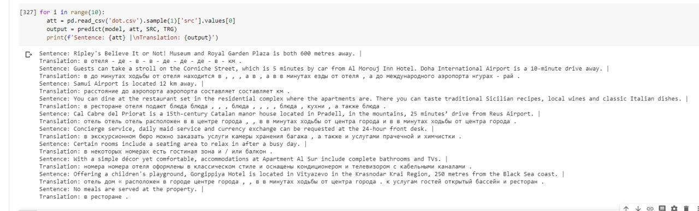

# Introduction
This is my notebook, in which i have described a way to make translator using PyTorch. 

Working with text is a popular branch in machine learning research. Here are the most powerful technologies and mathematics solutions. In this topic i am going to implement translator from english to russian. 

Ready? Go!

# Basics

I am going to use seq2seq model and the most common of this kind of models is encoder-decoder model, which use a `recurrent neural network (RNN)` to encode the source (input) sentence into a single vector. When we have a vector of the sentence, we can decode this vector and get the translation of the sentence. This is how this works:

(P.S. at the photo described german-english translation, but english-russian works the same way. Just another tokens)

The input(source) sentence passes through the encoder, collects hidden states and then goes into decoder model. The first initial hidden state of decoder model is the last hidden state of the encoder model. `<sos>` and `<eos>` tokens mean that the sentence starts and sentence ends. 

Lets say we have  , where  `<sos>`,  `guten` and etc. The initial hidden state, , is usually either initialized to zeros or a learned parameter.

Once the final word, , has been passed into the RNN via the embedding layer, we use the final hidden state, , as the context vector, i.e. . This is a vector representation of the entire source sentence.

Now we have our context vector, , we can start decoding it to get the output/target sentence, "good morning". Again, we append start and end of sequence tokens to the target sentence. At each time-step, the input to the decoder RNN (blue) is the embedding, , of current word, , as well as the hidden state from the previous time-step, , where the initial decoder hidden state, , is the context vector, , i.e. the initial decoder hidden state is the final encoder hidden state. Thus, similar to the encoder, we can represent the decoder as:

Although the input/source embedding layer, , and the output/target embedding layer, , are both shown in yellow in the diagram they are two different embedding layers with their own parameters.

In the decoder, we need to go from the hidden state to an actual word, therefore at each time-step we use  to predict (by passing it through a Linear layer, shown in purple) what we think is the next word in the sequence, .

The words in the decoder are always generated one after another, with one per time-step. We always use `<sos>` for the first input to the decoder, , but for subsequent inputs,  1}">, we will sometimes use the actual, ground truth next word in the sequence,   and sometimes use the word predicted by our decoder,  . This is called teacher forcing.

When training/testing our model, we always know how many words are in our target sentence, so we stop generating words once we hit that many. During inference it is common to keep generating words until the model outputs an `<eos>` token or after a certain amount of words have been generated.

Once we have our predicted target sentence,  , we compare it against our actual target sentence,  , to calculate our loss. We then use this loss to update all of the parameters in our model.

# Coding

The process is described in my [notebook](https://github.com/DmitryIo/translation/blob/master/translator.ipynb). Follow it and enjoy

# Dataset

The dataset is [here](https://github.com/DmitryIo/translation/blob/master/translation.csv)

# Conclusion

There is an example how it all works:

I am going to impove this result, adding `Attention`. This is a very powerful technology and this will be done in next notebook.

cred: https://github.com/bentrevett
